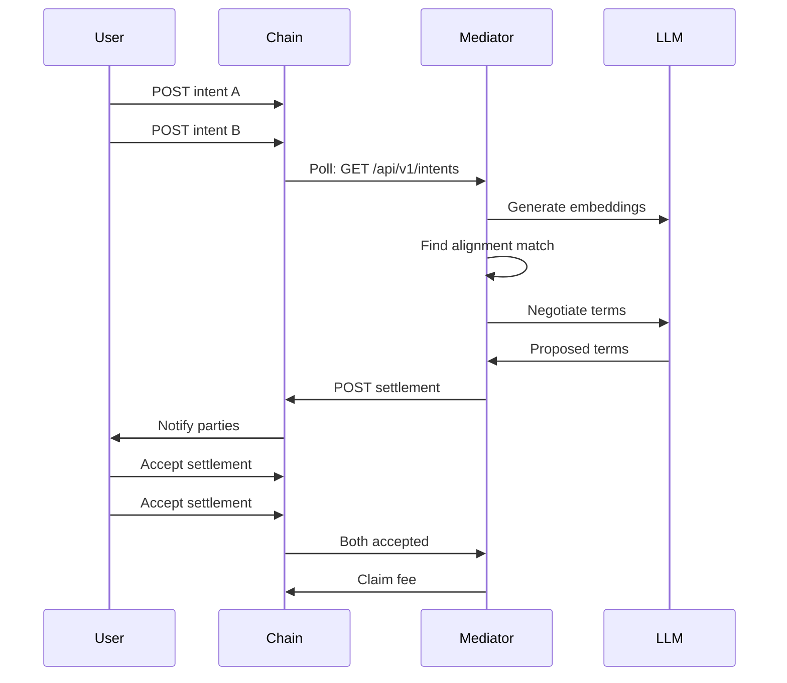

# Integration Guide

## Overview

The Mediator Node is designed to integrate with:
1. **NatLangChain Node(s)** - Main blockchain/chain instances
2. **Reputation Chain** (optional) - Separate chain for reputation tracking
3. **LLM Providers** - Anthropic Claude or OpenAI for negotiation

## NatLangChain Node Integration

### Required API Endpoints

The mediator node expects the following REST API endpoints on your NatLangChain node:

#### Intent Management

**GET /api/v1/intents**
- Query parameters:
  - `status` (string): Filter by status (pending, accepted, rejected, closed)
  - `since` (number): Unix timestamp to fetch intents since
  - `limit` (number): Maximum number of results
- Response:
```json
{
  "intents": [
    {
      "hash": "0xabc123...",
      "author": "user_pubkey_xyz",
      "prose": "I am offering X in exchange for Y...",
      "desires": ["collaboration", "payment"],
      "constraints": ["must complete within 30 days"],
      "offeredFee": 100,
      "timestamp": 1703001234567,
      "status": "pending",
      "branch": "Professional/Engineering"
    }
  ]
}
```

#### Entry Submission

**POST /api/v1/entries**
- Body:
```json
{
  "type": "settlement" | "accept" | "challenge" | "delegation" | "governance" | "payout",
  "author": "mediator_pubkey",
  "content": "Prose representation of the entry",
  "metadata": {
    "... type-specific data ..."
  },
  "signature": "cryptographic_signature"
}
```
- Response: `201 Created` with entry hash

#### Settlement Status

**GET /api/v1/settlements/:settlementId/status**
- Response:
```json
{
  "id": "settlement_xyz",
  "status": "proposed" | "accepted" | "rejected" | "closed",
  "partyAAccepted": true,
  "partyBAccepted": false,
  "challenges": [
    {
      "id": "challenge_abc",
      "challengerId": "challenger_pubkey",
      "status": "pending" | "upheld" | "rejected"
    }
  ]
}
```

#### Reputation

**GET /api/v1/reputation/:mediatorId**
- Response:
```json
{
  "mediatorId": "mediator_pubkey",
  "successfulClosures": 10,
  "failedChallenges": 2,
  "upheldChallengesAgainst": 0,
  "forfeitedFees": 1,
  "weight": 21.0,
  "lastUpdated": 1703001234567
}
```

**POST /api/v1/reputation**
- Body: Same as GET response
- Response: `200 OK`

#### Delegations (DPoS Mode)

**GET /api/v1/delegations/:mediatorId**
- Response:
```json
{
  "delegations": [
    {
      "delegatorId": "user_pubkey",
      "mediatorId": "mediator_pubkey",
      "amount": 1000,
      "timestamp": 1703001234567,
      "status": "active",
      "undelegationDeadline": null
    }
  ]
}
```

#### Stake Management (DPoS Mode)

**POST /api/v1/stake/bond**
- Body:
```json
{
  "mediatorId": "mediator_pubkey",
  "amount": 1000,
  "timestamp": 1703001234567
}
```
- Response: `200 OK`

**POST /api/v1/stake/unbond**
- Body:
```json
{
  "mediatorId": "mediator_pubkey",
  "timestamp": 1703001234567
}
```
- Response: `200 OK`

#### Authority Set (PoA Mode)

**GET /api/v1/consensus/authorities**
- Response:
```json
{
  "authorities": [
    "authority_pubkey_1",
    "authority_pubkey_2",
    "authority_pubkey_3"
  ]
}
```

#### Governance

**POST /api/v1/governance/proposals**
- Body:
```json
{
  "type": "parameter_change" | "authority_add" | "authority_remove" | "mode_transition",
  "proposerId": "mediator_pubkey",
  "title": "Proposal title",
  "description": "Detailed description",
  "parameters": {
    "... proposal-specific parameters ..."
  },
  "timestamp": 1703001234567
}
```
- Response: `201 Created` with proposal ID

## Multi-Chain Setup

To connect to multiple chains, you can run multiple mediator instances with different configurations:

```bash
# Chain 1 - Permissionless
CHAIN_ENDPOINT=http://localhost:8545 \
CHAIN_ID=natlang-1 \
CONSENSUS_MODE=permissionless \
node dist/cli.js start

# Chain 2 - DPoS
CHAIN_ENDPOINT=http://localhost:8546 \
CHAIN_ID=natlang-dpos \
CONSENSUS_MODE=dpos \
BONDED_STAKE_AMOUNT=1000 \
node dist/cli.js start

# Chain 3 - PoA
CHAIN_ENDPOINT=http://localhost:8547 \
CHAIN_ID=natlang-enterprise \
CONSENSUS_MODE=poa \
POA_AUTHORITY_KEY=your_authority_key \
node dist/cli.js start
```

Or use Docker Compose to orchestrate multiple instances.

## Testing Integration

### Using Mock Chain Server

For development and testing, use the included mock chain server:

```bash
cd examples/mock-chain
npm install
npm start
```

This starts a mock NatLangChain API on `http://localhost:8545` with example data.

### Integration Tests

Run integration tests against a mock or local chain:

```bash
npm run test:integration
```

## Related Repositories

- **natlangchain-node** - Main blockchain node implementation
- **natlangchain-sdk** - JavaScript SDK for interacting with NatLangChain
- **natlangchain-cli** - Command-line interface for users to post intents
- **mediator-node** (this repo) - Standalone mediator service

## Data Format Compatibility

### Intent Format

The mediator expects intents to follow this structure:

```typescript
interface Intent {
  hash: string;              // Unique identifier
  author: string;            // Public key of author
  prose: string;             // Natural language intent
  desires: string[];         // Extracted desires
  constraints: string[];     // Extracted constraints
  offeredFee?: number;       // Optional facilitation fee offer
  timestamp: number;         // Unix timestamp
  status: IntentStatus;      // Current status
  branch?: string;           // Optional categorization
  flagCount?: number;        // For unalignable tracking
}
```

### Settlement Format

Proposed settlements use this structure:

```typescript
interface ProposedSettlement {
  id: string;
  intentHashA: string;
  intentHashB: string;
  reasoningTrace: string;
  proposedTerms: {
    price?: number;
    deliverables?: string[];
    timelines?: string;
    escrowReference?: string;
    customTerms?: Record<string, any>;
  };
  facilitationFee: number;
  facilitationFeePercent: number;
  modelIntegrityHash: string;
  mediatorId: string;
  timestamp: number;
  status: SettlementStatus;
  acceptanceDeadline: number;
  // DPoS fields (optional)
  stakeReference?: string;
  effectiveStake?: number;
  // PoA fields (optional)
  authoritySignature?: string;
}
```

## Authentication

### Chain Authentication

If your NatLangChain node requires authentication:

1. Add authentication headers in the mediator code:

```typescript
// In src/ingestion/IntentIngester.ts
const response = await axios.get(`${this.config.chainEndpoint}/api/v1/intents`, {
  headers: {
    'Authorization': `Bearer ${process.env.CHAIN_API_TOKEN}`,
  },
  params: { ... }
});
```

2. Add `CHAIN_API_TOKEN` to your `.env` file

### LLM Authentication

API keys for Anthropic/OpenAI are already configured via:
- `ANTHROPIC_API_KEY`
- `OPENAI_API_KEY`

## Deployment

### Docker Deployment

```dockerfile
FROM node:18-alpine

WORKDIR /app

COPY package*.json ./
RUN npm ci --production

COPY dist/ ./dist/
COPY .env.example ./.env

CMD ["node", "dist/cli.js", "start"]
```

### Docker Compose with Chain

```yaml
version: '3.8'

services:
  natlangchain-node:
    image: natlangchain/node:latest
    ports:
      - "8545:8545"
    environment:
      - CHAIN_ID=natlang-1
      - CONSENSUS_MODE=permissionless

  mediator-node:
    build: .
    depends_on:
      - natlangchain-node
    environment:
      - CHAIN_ENDPOINT=http://natlangchain-node:8545
      - CHAIN_ID=natlang-1
      - ANTHROPIC_API_KEY=${ANTHROPIC_API_KEY}
```

## Monitoring Integration

### Health Checks

Add health check endpoint:

```typescript
// In src/cli.ts, add a health check server
import express from 'express';

const healthServer = express();
healthServer.get('/health', (req, res) => {
  const status = node.getStatus();
  res.json({
    status: status.isRunning ? 'healthy' : 'unhealthy',
    ...status
  });
});
healthServer.listen(9090);
```

### Prometheus Metrics

Export metrics for monitoring:

```typescript
import { Counter, Gauge, register } from 'prom-client';

const settlementsProposed = new Counter({
  name: 'mediator_settlements_proposed_total',
  help: 'Total number of settlements proposed'
});

const reputationWeight = new Gauge({
  name: 'mediator_reputation_weight',
  help: 'Current reputation weight'
});
```

## Troubleshooting Integration Issues

### Chain Connection Failed
- Verify `CHAIN_ENDPOINT` is correct and accessible
- Check if chain node is running and healthy
- Verify network connectivity and firewalls

### Intent Parsing Issues
- Ensure intents follow the expected JSON schema
- Check that `desires` and `constraints` arrays exist
- Verify timestamps are Unix milliseconds

### Settlement Submission Failed
- Verify mediator has proper authorization (PoA mode)
- Check stake requirements are met (DPoS mode)
- Ensure signature generation is working correctly

### Reputation Not Updating
- Check `REPUTATION_CHAIN_ENDPOINT` is set correctly
- Verify reputation chain API is accessible
- Check logs for API errors

## Example Integration Flow



## Support

For integration issues:
- Check [ARCHITECTURE.md](./ARCHITECTURE.md) for system design
- Review [spec.md](./spec.md) for protocol details
- Open an issue: https://github.com/kase1111-hash/mediator-node/issues
