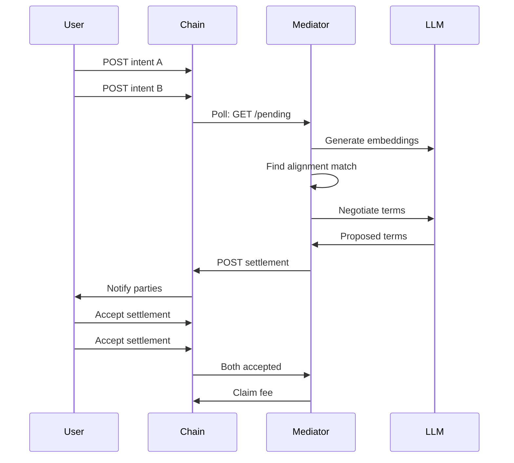

# Integration Guide

## Overview

The Mediator Node is designed to integrate with:
1. **NatLangChain Node(s)** - Main blockchain/chain instances
2. **Reputation Chain** (optional) - Separate chain for reputation tracking
3. **LLM Providers** - Anthropic Claude or OpenAI for negotiation

## NatLangChain Node Integration

### Required API Endpoints

The mediator node communicates with NatLangChain through `ChainClient` (`src/chain/ChainClient.ts`), which uses the following REST API endpoints. All endpoints use bare paths (no `/api/v1/` prefix).

#### Health & Status

**GET /health**
- Health check for the chain node
- Response: `200 OK` with status object

**GET /stats**
- Chain statistics
- Response: `200 OK` with chain stats

**GET /chain**
- Full blockchain data
- Response: `200 OK` with block data

**GET /validate/chain**
- Chain integrity validation
- Response: `200 OK` with `{ valid: boolean, issues?: string[] }`

#### Intent Discovery

**GET /pending**
- Fetch pending unmined entries (primary intent discovery endpoint)
- Response:
```json
[
  {
    "content": "I am offering X in exchange for Y...",
    "author": "user_pubkey_xyz",
    "intent": "offer",
    "timestamp": 1703001234567,
    "metadata": {
      "hash": "0xabc123...",
      "is_contract": true,
      "contract_type": "offer"
    }
  }
]
```

**GET /entries/search?intent=\<keyword\>**
- Keyword search for entries (fallback for intent discovery)
- Query parameters:
  - `intent` (string): Keyword to search for
  - `status` (string): Filter by status
- Response: Array of entries or `{ entries: [...] }`

**GET /entries/author/:author**
- Get entries by a specific author
- Response: Array of entries or `{ entries: [...] }`

**POST /search/semantic**
- Meaning-based search across chain entries
- Body:
```json
{
  "query": "search text",
  "top_k": 10,
  "field": "both",
  "min_score": 0.5
}
```
- Response: `{ results: [...] }`

#### Entry Submission

**POST /entry**
- Submit any type of entry to the chain (intents, settlements, challenges, payouts)
- Body:
```json
{
  "content": "Prose representation of the entry",
  "author": "mediator_pubkey",
  "intent": "entry_type_description",
  "metadata": {
    "type": "settlement | challenge | payout_claim",
    "...type-specific fields..."
  },
  "signature": "cryptographic_signature",
  "validate": true,
  "auto_mine": false
}
```
- Response: `200 OK` or `201 Created`

#### Contract/Settlement Operations

**GET /contract/list?status=open**
- List contracts by status (used to find open settlement proposals)
- Response: Array of contracts or `{ contracts: [...] }`

**POST /contract/propose**
- Submit a settlement/contract proposal
- Body:
```json
{
  "offer_ref": "intent_hash_A",
  "seek_ref": "intent_hash_B",
  "mediator_id": "mediator_pubkey",
  "terms": "Proposed settlement terms...",
  "facilitation_fee": 1.5,
  "acceptance_deadline": 1703260000000
}
```
- Response: `200 OK` or `201 Created`

**POST /contract/respond**
- Accept or reject a contract
- Response: `200 OK`

**POST /contract/payout**
- Claim facilitation fee after settlement closure
- Body:
```json
{
  "settlement_ref": "settlement_id",
  "mediator_id": "mediator_pubkey",
  "fee_amount": 1.5
}
```
- Response: `200 OK` or `201 Created`

**POST /contract/match**
- Find matching contracts (supplements local vector search)
- Body:
```json
{
  "content": "intent description",
  "top_k": 5
}
```
- Response: `{ matches: [...] }`

#### Reputation

**GET /reputation/:id**
- Load mediator reputation
- Response: Reputation object with `successfulClosures`, `failedChallenges`, `upheldChallengesAgainst`, `forfeitedFees`, `weight`

**POST /reputation**
- Update mediator reputation
- Response: `200 OK`

## WebSocket Integration

The mediator node provides real-time event streaming via WebSocket.

### Connection

```javascript
const ws = new WebSocket('ws://localhost:9000');

// Authenticate (if required)
ws.send(JSON.stringify({
  action: 'authenticate',
  identity: 'your-public-key',
  timestamp: Date.now(),
  signature: 'signature-of-timestamp',
  nonce: 'unique-nonce'
}));

// Subscribe to events
ws.send(JSON.stringify({
  action: 'subscribe',
  topics: ['settlement.proposed', 'settlement.accepted', 'challenge.submitted'],
  filters: {
    parties: ['your-public-key']
  }
}));

// Handle events
ws.onmessage = (event) => {
  const message = JSON.parse(event.data);
  console.log('Event:', message.type, message.payload);
};
```

### Available Event Topics

| Category | Events |
|----------|--------|
| Intent | `intent.submitted`, `intent.accepted`, `intent.rejected`, `intent.closed` |
| Settlement | `settlement.proposed`, `settlement.accepted`, `settlement.challenged`, `settlement.closed` |
| Challenge | `challenge.submitted`, `challenge.upheld`, `challenge.rejected` |
| Dispute (MP-03) | `dispute.initiated`, `dispute.clarifying`, `dispute.resolved`, `dispute.escalated` |
| Receipt (MP-02) | `receipt.created`, `receipt.validated`, `receipt.anchored` |
| Burn (MP-06) | `burn.executed`, `burn.escalated`, `burn.load_scaled` |
| System | `system.node_status_changed`, `system.health_update` |

See [_deferred/docs/API.md](./_deferred/docs/API.md) for complete WebSocket documentation.

## Multi-Chain Setup

To connect to multiple chains, you can run multiple mediator instances with different configurations:

```bash
# Chain 1 - Permissionless
CHAIN_ENDPOINT=http://localhost:8545 \
CHAIN_ID=natlang-1 \
CONSENSUS_MODE=permissionless \
node dist/cli.js start

# Chain 2 - DPoS
CHAIN_ENDPOINT=http://localhost:8546 \
CHAIN_ID=natlang-dpos \
CONSENSUS_MODE=dpos \
BONDED_STAKE_AMOUNT=1000 \
node dist/cli.js start

# Chain 3 - PoA
CHAIN_ENDPOINT=http://localhost:8547 \
CHAIN_ID=natlang-enterprise \
CONSENSUS_MODE=poa \
POA_AUTHORITY_KEY=your_authority_key \
node dist/cli.js start
```

Or use Docker Compose to orchestrate multiple instances.

## Testing Integration

### Using Mock Chain Server

For development and testing, use the included mock chain server:

```bash
cd examples/mock-chain
npm install
npm start
```

This starts a mock NatLangChain API on `http://localhost:8545` with example data.

### Integration Tests

Run all tests (including integration tests) against a mock or local chain:

```bash
npm test
```

## Related Repositories

- **natlangchain-node** - Main blockchain node implementation
- **natlangchain-sdk** - JavaScript SDK for interacting with NatLangChain
- **natlangchain-cli** - Command-line interface for users to post intents
- **mediator-node** (this repo) - Standalone mediator service

## Data Format Compatibility

### Intent Format

The mediator expects intents to follow this structure:

```typescript
interface Intent {
  hash: string;              // Unique identifier
  author: string;            // Public key of author
  prose: string;             // Natural language intent
  desires: string[];         // Extracted desires
  constraints: string[];     // Extracted constraints
  offeredFee?: number;       // Optional facilitation fee offer
  timestamp: number;         // Unix timestamp
  status: IntentStatus;      // Current status
  branch?: string;           // Optional categorization
  flagCount?: number;        // For unalignable tracking
}
```

### Settlement Format

Proposed settlements use this structure:

```typescript
interface ProposedSettlement {
  id: string;
  intentHashA: string;
  intentHashB: string;
  reasoningTrace: string;
  proposedTerms: {
    price?: number;
    deliverables?: string[];
    timelines?: string;
    escrowReference?: string;
    customTerms?: Record<string, any>;
  };
  facilitationFee: number;
  facilitationFeePercent: number;
  modelIntegrityHash: string;
  mediatorId: string;
  timestamp: number;
  status: SettlementStatus;
  acceptanceDeadline: number;
  // DPoS fields (optional)
  stakeReference?: string;
  effectiveStake?: number;
  // PoA fields (optional)
  authoritySignature?: string;
}
```

## Authentication

### Chain Authentication

If your NatLangChain node requires authentication, you would need to extend the `ChainClient` class (`src/chain/ChainClient.ts`) to include authentication headers in requests. The `ChainClient` uses axios with a configurable base URL, so authentication can be added via request interceptors or by modifying the axios instance configuration.

### LLM Authentication

API keys for Anthropic/OpenAI are already configured via:
- `ANTHROPIC_API_KEY`
- `OPENAI_API_KEY`

## Deployment

### Docker Deployment

The project includes a `Dockerfile` and `docker-compose.yml` for containerized deployment:

```bash
# Build and start with Docker Compose (includes mock chain)
docker-compose up

# Or build separately
docker-compose build
docker-compose up -d

# View logs
docker-compose logs -f mediator-node
```

The `docker-compose.yml` defines services for the mock chain and one or more mediator nodes, with configurable environment variables passed through from the host.

## Monitoring Integration

### Health Checks

The mediator node includes a built-in health server (`src/monitoring/HealthServer.ts`) that provides HTTP health endpoints. Configure it via the `HEALTH_SERVER_PORT` environment variable (default: 9090).

**Available endpoints:**
- `GET /health` — Full health report with component status
- `GET /health/live` — Kubernetes liveness probe
- `GET /health/ready` — Kubernetes readiness probe

The health server monitors vector database status, chain client connectivity, LLM provider availability, and memory/CPU usage.

## Troubleshooting Integration Issues

### Chain Connection Failed
- Verify `CHAIN_ENDPOINT` is correct and accessible
- Check if chain node is running and healthy
- Verify network connectivity and firewalls

### Intent Parsing Issues
- Ensure intents follow the expected JSON schema
- Check that `desires` and `constraints` arrays exist
- Verify timestamps are Unix milliseconds

### Settlement Submission Failed
- Verify mediator has proper authorization (PoA mode)
- Check stake requirements are met (DPoS mode)
- Ensure signature generation is working correctly

### Reputation Not Updating
- Check `REPUTATION_CHAIN_ENDPOINT` is set correctly
- Verify reputation chain API is accessible
- Check logs for API errors

## Example Integration Flow



## Support

For integration issues:
- Check [ARCHITECTURE.md](./ARCHITECTURE.md) for system design
- Review [spec.md](./spec.md) for protocol details
- Open an issue: https://github.com/kase1111-hash/mediator-node/issues
